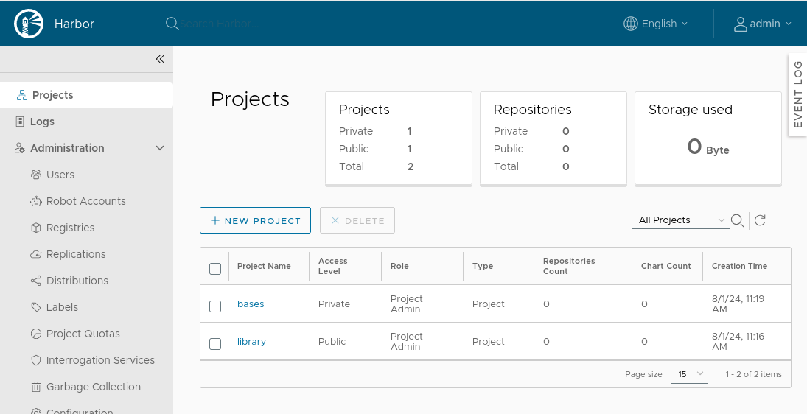

# 企业级Harbor镜像仓库搭建

> 安装要求: docker 20.10.10-ce+ and docker-compose 1.18.0+ .

- 主机名解析
```
echo "192.168.122.250 reg.linux.io" >> /etc/hosts
```
## 安装docker

- 安装docker

```
hostnamectl  set-hostname reg.linux.io
sudo apt-get remove docker docker-engine docker.io
sudo apt-get install apt-transport-https ca-certificates curl gnupg2 software-properties-common -y
curl -fsSL https://mirrors.huaweicloud.com/docker-ce/linux/ubuntu/gpg | sudo apt-key add -
sudo add-apt-repository "deb [arch=amd64] https://mirrors.huaweicloud.com/docker-ce/linux/ubuntu $(lsb_release -cs) stable"
sudo apt-get update
apt-cache madison docker-ce
apt install docker-ce=5:20.10.22~3-0~ubuntu-focal
```

- 配置docker加速器

```
mkdir -pv /etc/docker
sudo tee /etc/docker/daemon.json <<-'EOF'
{
    "exec-opts": ["native.cgroupdriver=systemd"],
    "registry-mirrors": [
        "https://docker.rainbond.cc"
    ]

}
EOF
systemctl restart docker
```

## 安装docker-compose

```
wget https://github.com/docker/compose/releases/download/v2.26.0/docker-compose-linux-x86_64
mv docker-compose-linux-x86_64 /usr/local/bin/docker-compose
chmod +x /usr/local/bin/docker-compose

docker-compose  version
```

## 安装Harbor

- 获取并解压安装包

```
wget https://github.com/goharbor/harbor/releases/download/v2.5.4/harbor-online-installer-v2.5.4.tgz
tar -xf harbor-online-installer-v2.5.4.tgz  -C /opt/
```
- 配置https证书

```
mkdir /opt/harbor/ssl
cd /opt/harbor/ssl
# Generate a CA certificate private key.
openssl genrsa -out ca.key 4096
# Generate the CA certificate.
openssl req -x509 -new -nodes -sha512 -days 3650 \
 -subj "/C=CN/ST=Beijing/L=Beijing/O=example/OU=Personal/CN=reg.linux.io" \
 -key ca.key \
 -out ca.crt
# Generate a private key for harbor server.
openssl genrsa -out reg.linux.io.key 4096
# Generate a certificate signing request (CSR).
openssl req -sha512 -new \
    -subj "/C=CN/ST=Beijing/L=Beijing/O=example/OU=Personal/CN=reg.linux.io" \
    -key reg.linux.io.key \
    -out reg.linux.io.csr
# Generate an x509 v3 extension file.
cat > v3.ext <<-EOF
authorityKeyIdentifier=keyid,issuer
basicConstraints=CA:FALSE
keyUsage = digitalSignature, nonRepudiation, keyEncipherment, dataEncipherment
extendedKeyUsage = serverAuth
subjectAltName = @alt_names

[alt_names]
DNS.1=reg.linux.io
DNS.2=reg.linux.io
DNS.3=192.168.122.100
EOF
# Use the v3.ext file to generate a certificate for your Harbor host.
openssl x509 -req -sha512 -days 3650 \
    -extfile v3.ext \
    -CA ca.crt -CAkey ca.key -CAcreateserial \
    -in reg.linux.io.csr \
    -out reg.linux.io.crt
```

- 配置harbor.cfg

```
cp /opt/harbor/harbor.yml.tmpl /opt/harbor/harbor.yml
vim /opt/harbor/harbor.yml
hostname: reg.linux.io

# http related config
http:
  # port for http, default is 80. If https enabled, this port will redirect to https port
  port: 80

# https related config
https:
  # https port for harbor, default is 443
  port: 443
  # The path of cert and key files for nginx

  certificate: /opt/harbor/ssl/reg.linux.io.crt
  private_key: /opt/harbor/ssl/reg.linux.io.key
```

- 安装harbor

```
cd /opt/harbor/ && ./prepare
./install.sh --with-chartmuseum
```

```
# stop harbor image data remains in the file system, so no data is lost.
docker-compose down -v
# Restart Harbor
docker-compose up -d
```

## 访问Harbor



## 配置Docker推送镜像到Harbor

- Convert` reg.linux.crt` to `reg.linux.io.cert`, for use by Docker

```
ssl# openssl x509 -inform PEM -in reg.linux.io.crt -out reg.linux.io.cert
```

- Copy the server certificate, key and CA files into the Docker certificates folder on the Harbor host.

```
ssl# mkdir -pv  /etc/docker/certs.d/reg.linux.io/
ssl# cp reg.linux.io.cert  /etc/docker/certs.d/reg.linux.io/
ssl# cp reg.linux.io.key  /etc/docker/certs.d/reg.linux.io/
ssl# cp ca.crt  /etc/docker/certs.d/reg.linux.io/
```
```
ssl# docker login reg.linux.io -u admin -p Harbor12345
WARNING! Using --password via the CLI is insecure. Use --password-stdin.
WARNING! Your password will be stored unencrypted in /root/.docker/config.json.
Configure a credential helper to remove this warning. See
https://docs.docker.com/engine/reference/commandline/login/#credential-stores

Login Succeeded
```

- Push image to Harbor

```
~# docker tag centos:7 reg.linux.io/bases/centos:7
~# docker push reg.linux.io/bases/centos:7
```