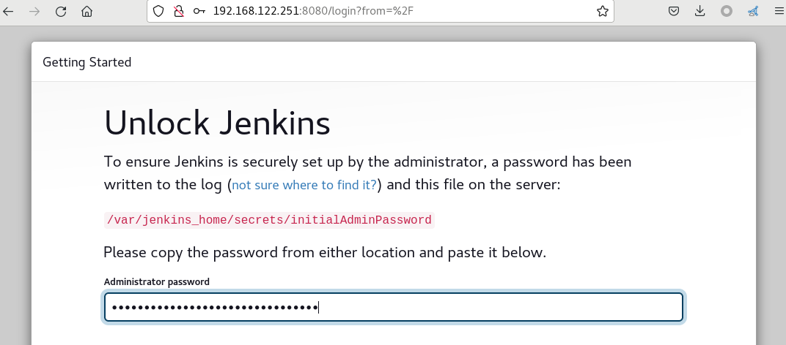
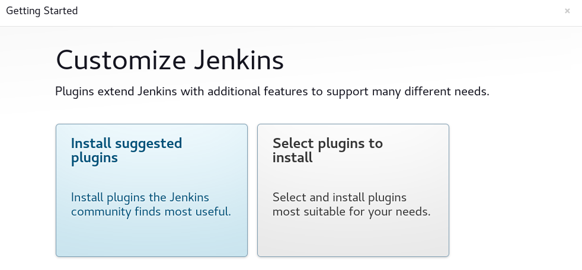
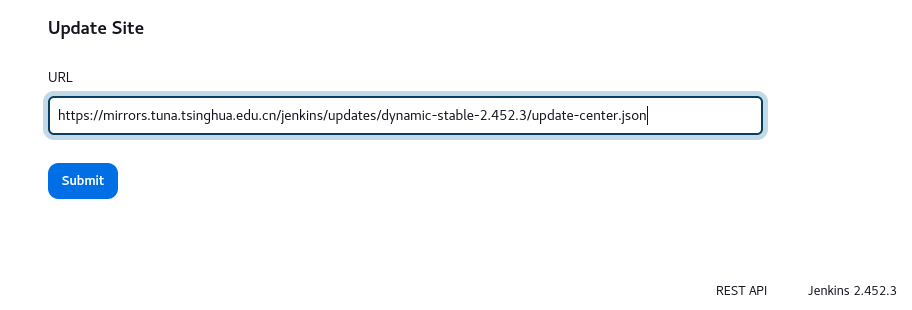

```
~# mkdir -pv /data/apps/jenkins/{data,tools}
~# chmod 777 -R  /data/apps/jenkins
```

```
cd /data/apps/jenkins
cat > docker-compose.yml << EOF
version: '3.1'
services:
  jenkins:
    image: jenkins/jenkins:lts-jdk17
    container_name: jenkins
    ports:
      - 8080:8080
      - 50000:50000
    volumes:
      - ./data/:/var/jenkins_home/
      - ./tools/:/var/jenkins_home/tools
      - /etc/localtime:/etc/localtime
EOF

docker-compose up 
```




- 设置密码账号为 admin/admin123

- 修改插件地址为国内地址：`https://mirrors.tuna.tsinghua.edu.cn/jenkins/updates/dynamic-stable-2.452.3/`
    - dynamic-stable-2.452.3为Jenkins版本号

