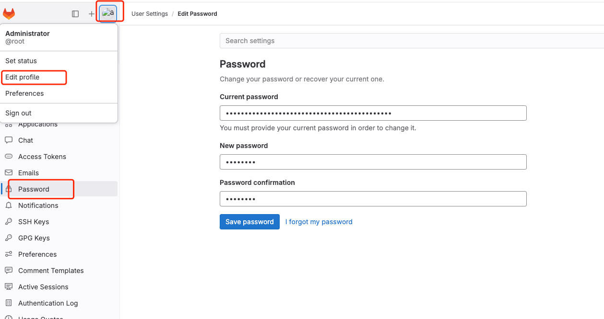

```
mkdir -pv /data/apps/gitlab/{config,logs,data}
chmod  777 -R /data/apps/gitlab
```

```
cd /data/apps/gitlab
~# echo "192.168.122.252 gitlab.linux.io" > /etc/hosts
cat > docker-compose.yml  << EOF
version: '3.1'
services:
    gitlab:
        image: 'gitlab/gitlab-ce:latest'
        container_name: gitlab
        restart: always
        environment:
            GITLAB_OMNIBUS_CONFIG: |
                external_url 'http://gitlab.linux.io:8000' # host文件需要能解析这个地址
                gitlab_rails['gitlab_shell_ssh_port'] = 22422
        ports:
            - '8000:8000'
            - '22422:22422'
        volumes:
            - './config:/etc/gitlab'
            - './logs:/var/log/gitlab'
            - './data:/var/opt/gitlab'
EOF
```

- 获取初始登陆密码

```
docker-compose  exec -it  gitlab  cat /etc/gitlab/initial_root_password
```


- 修改账号root 密码为： dy6545286
