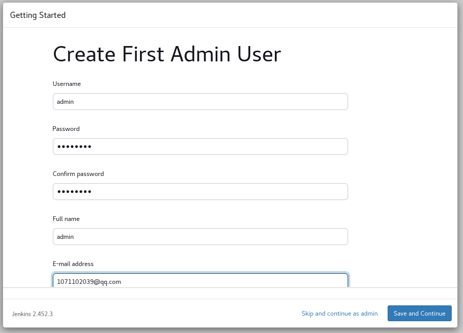

# Jenkins

## Install Jenkins On Ubuntu20.04

1. installation of Java

```shell
sudo apt update
sudo apt install fontconfig openjdk-17-jre
```

2. get deb package from mirrors.tuna.tsinghua.edu.cn

```shell
wget https://mirrors.tuna.tsinghua.edu.cn/jenkins/debian-stable/jenkins_2.452.3_all.deb
```

3. installation of jenkins

```shell
apt install ./jenkins_2.452.3_all.deb
or
sudo dpkg -i ./jenkins_2.452.3_all.deb
```

4. access jenkins ui

The access address is  `http://192.168.122.251:8080/`
- Unlock Jenkins


- Install suggested plugins


- Create First Admin User


- Instance Configuration


- Jenkins is ready!


4. A simple pipeline

```shell
pipeline {

	agent any

	// tools {}

	options {
	  buildDiscarder(logRotator(numToKeepStr: '5'))
	}

	environment {
	   FOO = "foo"
	}

	parameters {
	  string(name: "Image_Tag", defaultValue: 'main', description: '')
	  booleanParam(name: "PushImage", defaultValue: true)
	}

	stages {
		stage ('Echo') {
			steps {
				sh'''
				echo "${env.FOO}"
				echo "${params.Image_Tag}"
				'''
			}
		}
		stage('Build') { 
			steps { 
				sh 'pwd' 
			}
		}
		stage('Test'){
			steps {
				echo "Test"
			}
		}
		stage('Deploy') {
			steps {
				echo "Deploy"
			}
		}
	} 
	post {
	  always {
		 script {
			echo "I am execute always"
		 }
	  }
	  success {
		 script {
			echo "I am execute on success"
		 }
	  }
	  failure {
		 script {
			echo "I am execute on failure"
		 }
	  }
	}
}
```


## Install Jenkins By Docker

