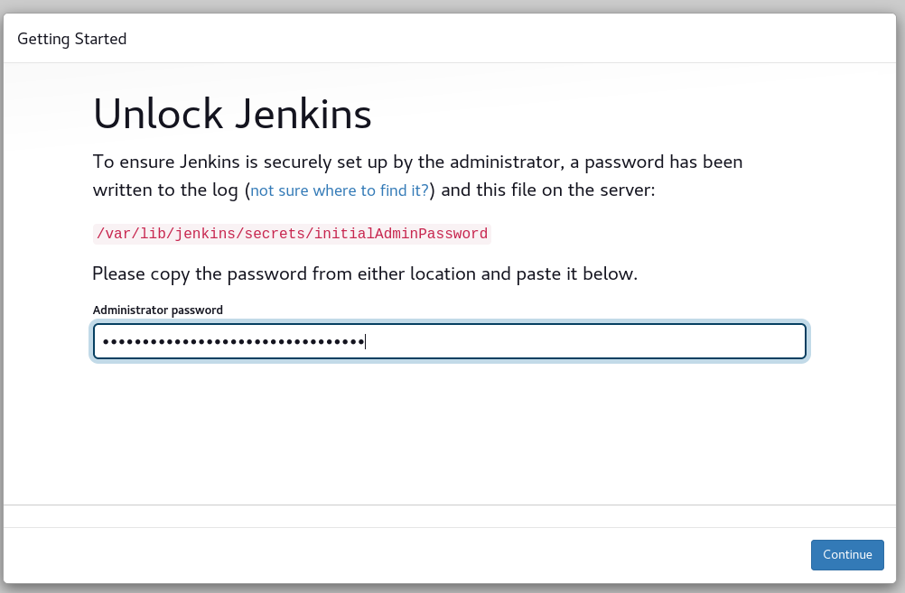
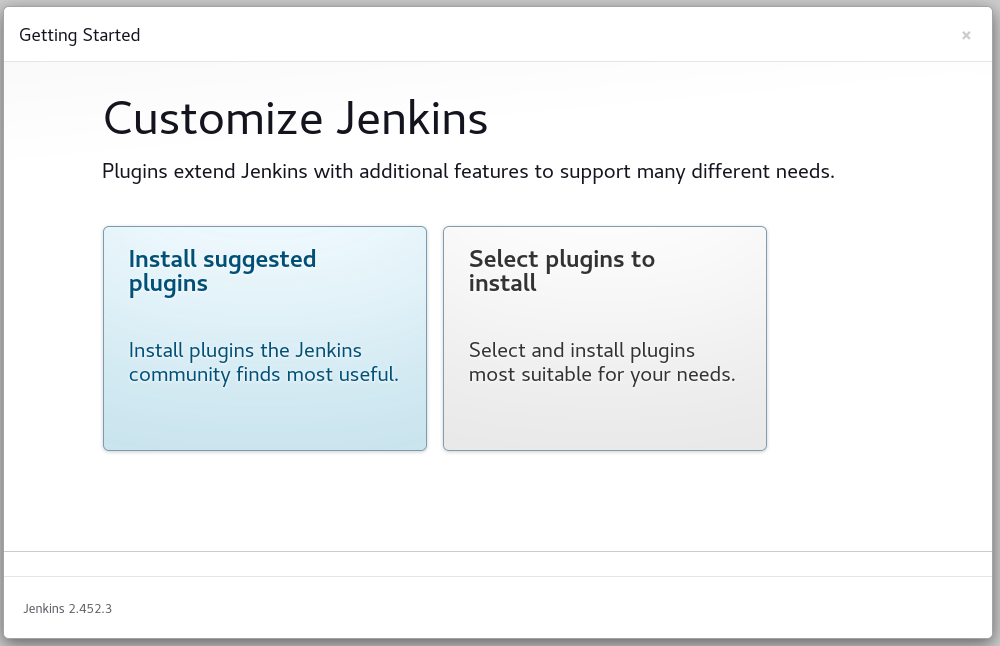
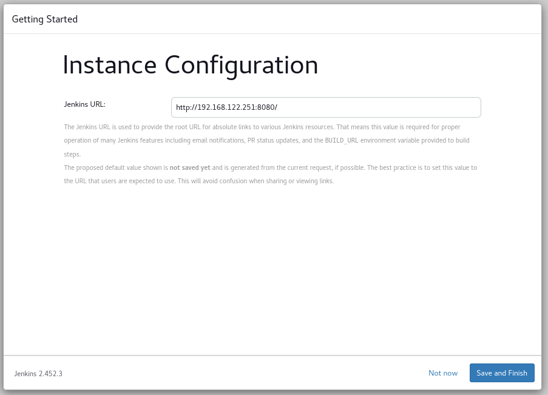
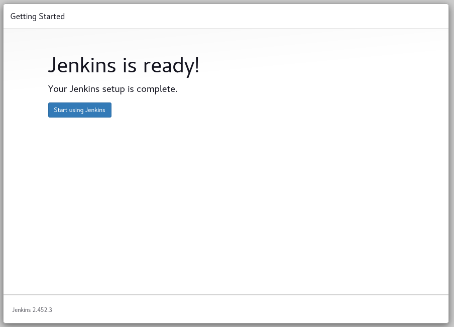
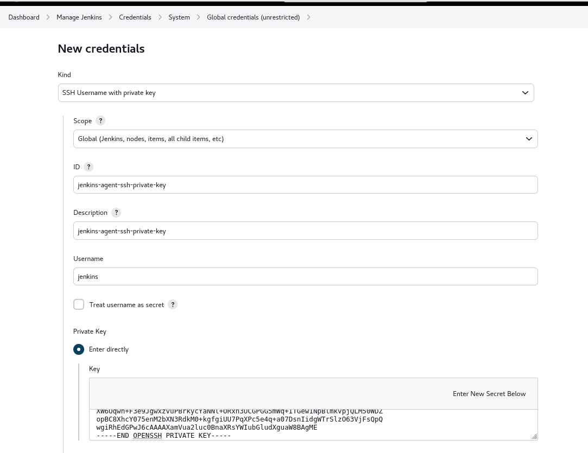
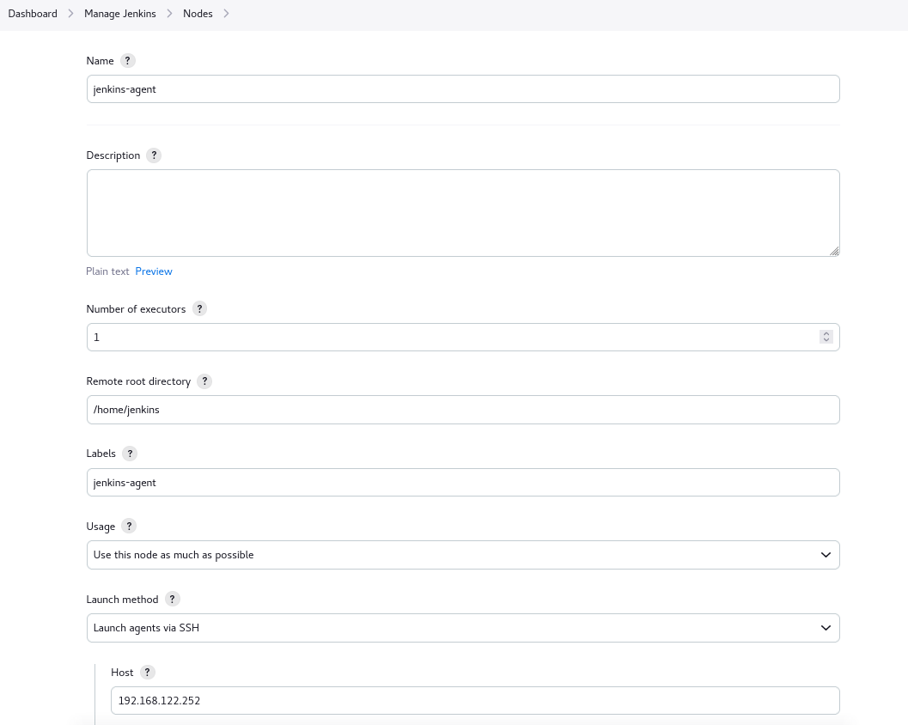
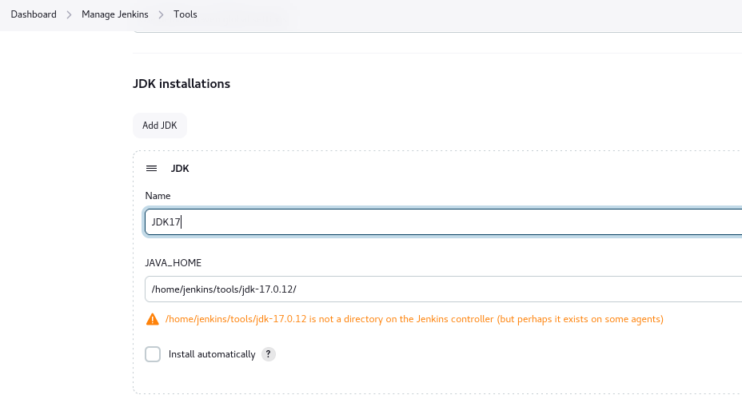
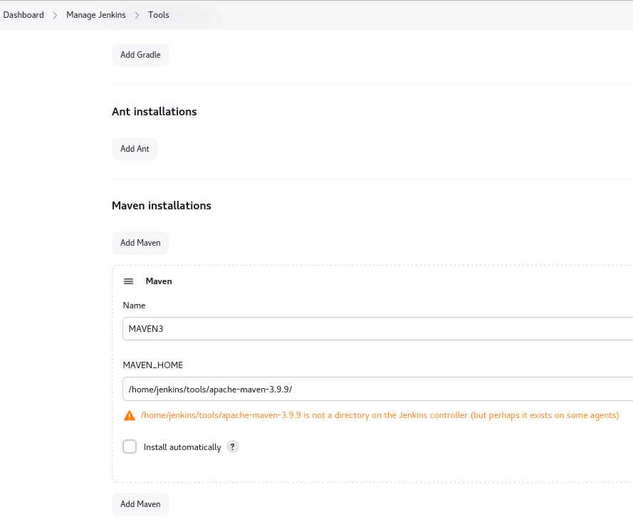
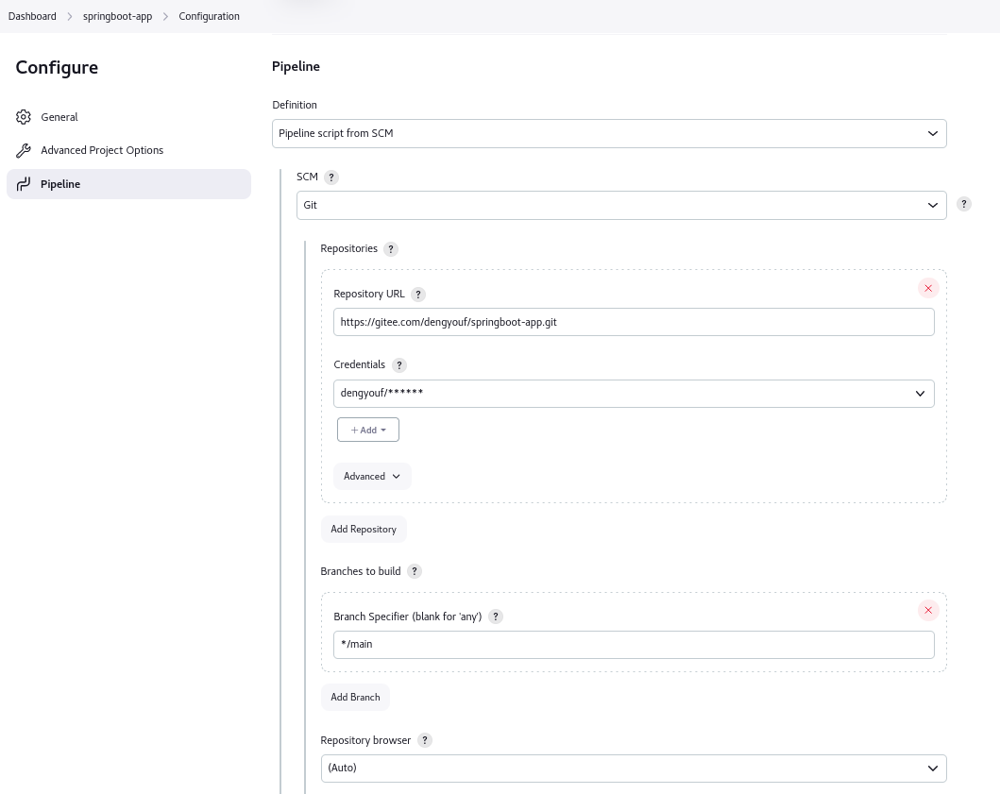

# Jenkins

## Install Jenkins On Ubuntu20.04

1. 安装 Java

```shell
sudo apt update
sudo apt install fontconfig openjdk-17-jre
```

2. 获取软件包

```shell
wget https://mirrors.tuna.tsinghua.edu.cn/jenkins/debian-stable/jenkins_2.452.3_all.deb
```

3. 安装jenkins

```shell
apt install ./jenkins_2.452.3_all.deb
or
dpkg -i ./jenkins_2.452.3_all.deb
```

4. 访问Jenkins 

The access address is  `http://192.168.122.251:8080/`
- Unlock Jenkins


- Install suggested plugins


- Create First Admin User


- Instance Configuration


- Jenkins is ready!


5. 简单的pipeline示例

```shell
pipeline {

	agent any

	// tools {}

	options {
	  buildDiscarder(logRotator(numToKeepStr: '5'))
	}

	environment {
	   FOO = "foo"
	}

	parameters {
	  string(name: "Branch", defaultValue: 'main', description: '')
	  booleanParam(name: "PushImage", defaultValue: true)
	}

	stages {
		stage ('Echo') {
			steps {
				sh'''
				echo "${env.FOO}"
				echo "${params.Image_Tag}"
				'''
			}
		}
		stage('Build') { 
			steps { 
				sh 'pwd' 
			}
		}
		stage('Test'){
			steps {
				echo "Test"
			}
		}
		stage('Deploy') {
			steps {
				echo "Deploy"
			}
		}
	} 
	post {
	  always {
		 script {
			echo "I am execute always"
		 }
	  }
	  success {
		 script {
			echo "I am execute on success"
		 }
	  }
	  failure {
		 script {
			echo "I am execute on failure"
		 }
	  }
	}
}
```

## Install Jenkins By Docker

## Add an Agent to Jenkins UI

1. 安装 java
```shell
sudo apt update
sudo apt install fontconfig openjdk-17-jre
```
2. 创建jenkins用户，并且生成密钥对

```shell
# 在 Agent 机器上执行
adduser  jenkins

su - jenkins
ssh-keygen  -t rsa
chmod 700 ~/.ssh

# 在 Jenkins 机器上执行
su - jenkins
ssh jenkins@192.168.122.252 # agent IP
```

3. 添加agent私钥到 Jenkins 凭据
```shell
# 在 agent 机器上执行
cat ~/.ssh/id_rsa
```


4. 添加agent Node


5. 简单测试

```shell
pipeline {

	agent { label 'jenkins-agent' }

	stages {
		stage ('Test') {
			steps {
				sh'echo "Test"'
			}
		}
	} 
}
```

## Build a Java app with Maven

> 所有构建任务都放在 Agent ，so 需要在Agent机器上准备构建工具

- 项目地址：https://github.com/dengyouf/springboot-app.git
- JDK：java17
- Maven： 3.6+

1. 安装Jdk & Maven

```shell
# 在 agent 机器上操作
su - jenkins
wget https://download.oracle.com/java/17/latest/jdk-17_linux-x64_bin.tar.gz
wget https://dlcdn.apache.org/maven/maven-3/3.9.9/binaries/apache-maven-3.9.9-bin.tar.gz

mkdir tools

tar -xf jdk-17_linux-x64_bin.tar.gz -C ~/tools
tar -xf apache-maven-3.9.9-bin.tar.gz -C ~/tools

vim .bashrc
JAVA_HOME="/home/jenkins/tools/jdk-17.0.12/"
MAVEN_HOME="/home/jenkins/tools/apache-maven-3.9.9/"
PATH=$JAVA_HOME/bin:$MAVEN_HOME/bin:$PATH
export PATH

java -version
java version "17.0.12" 2024-07-16 LTS
Java(TM) SE Runtime Environment (build 17.0.12+8-LTS-286)
Java HotSpot(TM) 64-Bit Server VM (build 17.0.12+8-LTS-286, mixed mode, sharing)

mvn -v
Apache Maven 3.9.9 (8e8579a9e76f7d015ee5ec7bfcdc97d260186937)
Maven home: /home/jenkins/tools/apache-maven-3.9.9
Java version: 17.0.12, vendor: Oracle Corporation, runtime: /home/jenkins/tools/jdk-17.0.12
Default locale: en_US, platform encoding: UTF-8
OS name: "linux", version: "5.4.0-192-generic", arch: "amd64", family: "unix"
```

2. 配置Jenkins 添加 全局工具

- 添加JDK(JDK17)


- 添加Maven(MAVEN3)


3. 向代码仓库中添加Jenkinsfile，内容如下

```shell
pipeline {
    agent {
        label "jenkins-agent"
    }

    tools {
        jdk 'JDK17'
        maven 'MAVEN3'
    }

    stages {
        stage("Cleanup Workspace") {
            steps {
                cleanWs()
            }
        }

        stage("Checkout form SCM") {
            steps {
                git branch: 'main', 
                // credentialsId: 'github', 
                url: 'https://github.com/dengyouf/springboot-app.git'
            }
        }
    }
}
```

4. 创建 Job-springboot-app




