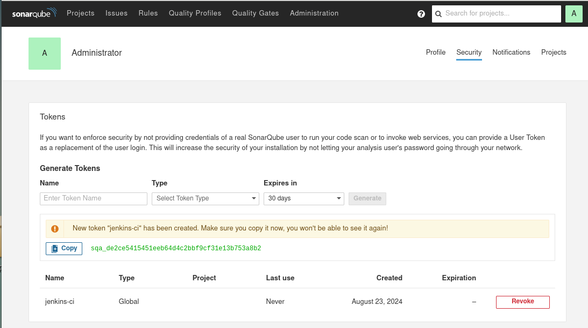
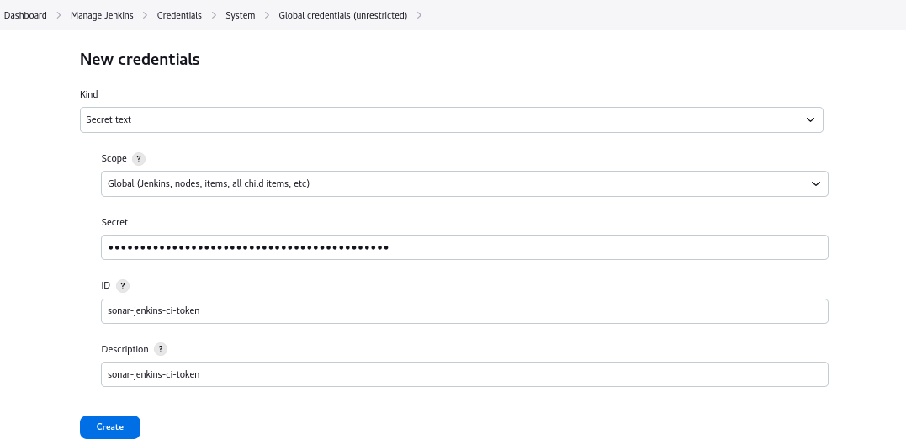
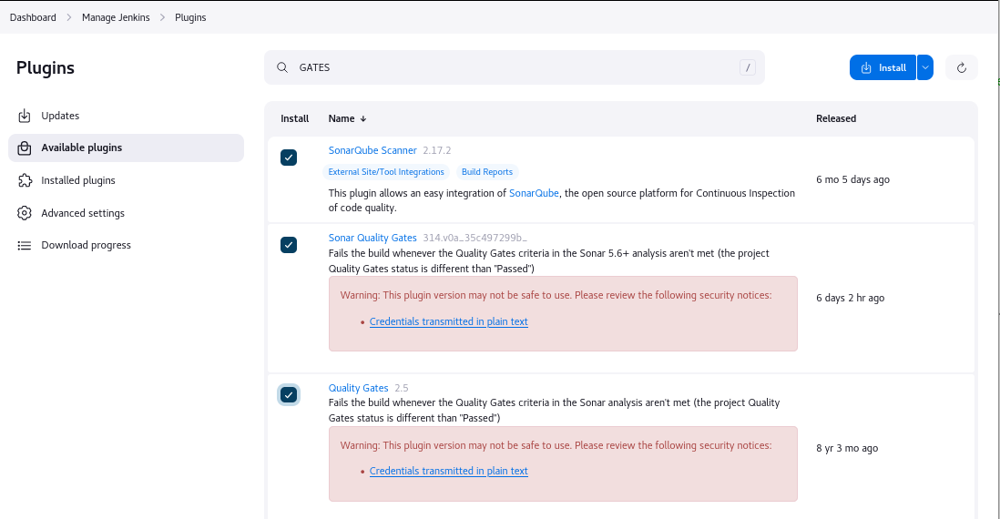
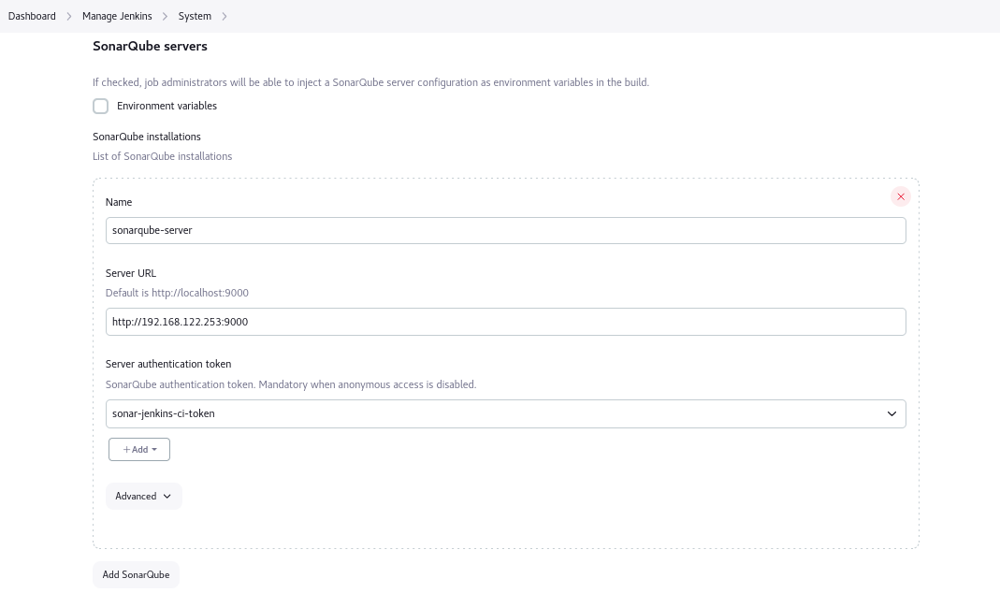
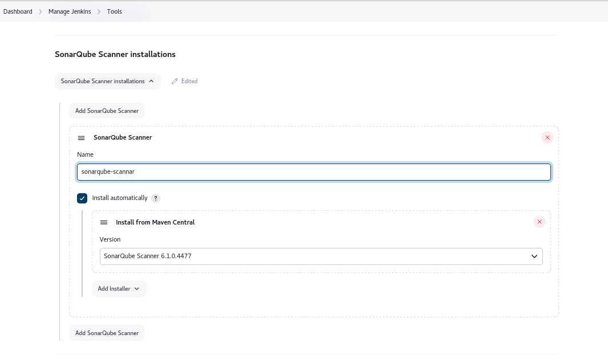
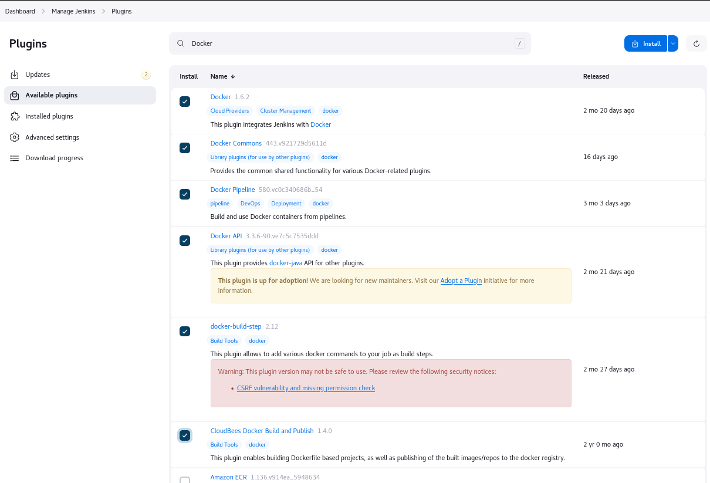
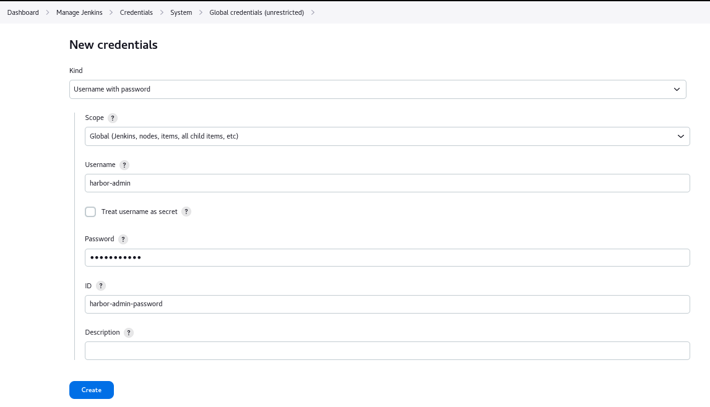
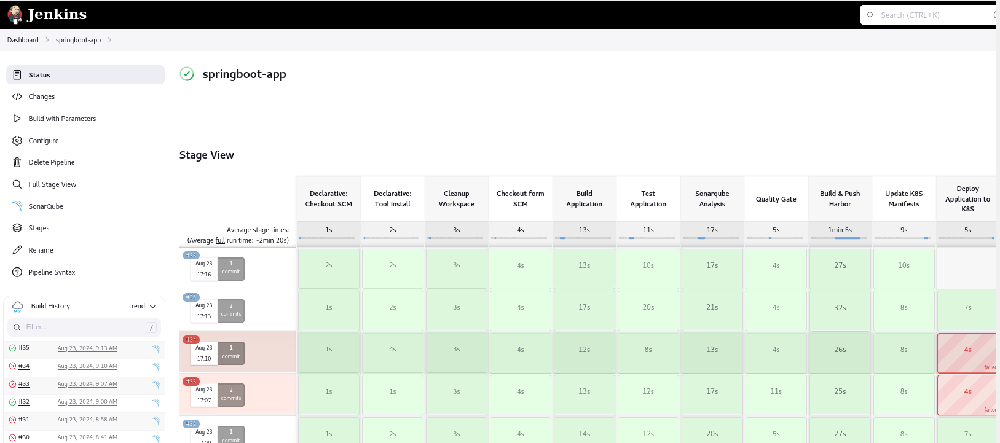

# Jenkins

## Install Jenkins On Ubuntu20.04

1. 安装 Java

```shell
sudo apt update
sudo apt install fontconfig openjdk-17-jre
```

2. 获取软件包

```shell
wget https://mirrors.tuna.tsinghua.edu.cn/jenkins/debian-stable/jenkins_2.452.3_all.deb
```

3. 安装jenkins

```shell
apt install ./jenkins_2.452.3_all.deb
or
dpkg -i ./jenkins_2.452.3_all.deb
```

4. 访问Jenkins 

The access address is  `http://192.168.122.251:8080/`
- Unlock Jenkins


- Install suggested plugins


- Create First Admin User


- Instance Configuration


- Jenkins is ready!


5. 简单的pipeline示例

```shell
pipeline {

	agent any

	// tools {}

	options {
	  buildDiscarder(logRotator(numToKeepStr: '5'))
	}

	environment {
	   FOO = "foo"
	}

	parameters {
	  string(name: "Branch", defaultValue: 'main', description: '')
	  booleanParam(name: "PushImage", defaultValue: true)
	}

	stages {
		stage ('Echo') {
			steps {
				sh'''
				echo "${env.FOO}"
				echo "${params.Image_Tag}"
				'''
			}
		}
		stage('Build') { 
			steps { 
				sh 'pwd' 
			}
		}
		stage('Test'){
			steps {
				echo "Test"
			}
		}
		stage('Deploy') {
			steps {
				echo "Deploy"
			}
		}
	} 
	post {
	  always {
		 script {
			echo "I am execute always"
		 }
	  }
	  success {
		 script {
			echo "I am execute on success"
		 }
	  }
	  failure {
		 script {
			echo "I am execute on failure"
		 }
	  }
	}
}
```

## Install Jenkins By Docker

## Add an Agent to Jenkins UI

1. 安装 java
```shell
sudo apt update
sudo apt install fontconfig openjdk-17-jre
```
2. 创建jenkins用户，并且生成密钥对

```shell
# 在 Agent 机器上执行
adduser  jenkins

su - jenkins
ssh-keygen  -t rsa
chmod 700 ~/.ssh

# 在 Jenkins 机器上执行
su - jenkins
ssh jenkins@192.168.122.252 # agent IP
```

3. 添加agent私钥到 Jenkins 凭据
```shell
# 在 agent 机器上执行
cat ~/.ssh/id_rsa
```


4. 添加agent Node


5. 简单测试

```shell
pipeline {

	agent { label 'jenkins-agent' }

	stages {
		stage ('Test') {
			steps {
				sh'echo "Test"'
			}
		}
	} 
}
```

## Build a Java app with Maven

> 所有构建任务都放在 Agent ，so 需要在Agent机器上准备构建工具

- 项目地址：https://gitee.com/dengyouf/springboot-app.git
- JDK：java17
- Maven： 3.6+

1. 安装Jdk & Maven

```shell
# 在 agent 机器上操作
su - jenkins
wget https://download.oracle.com/java/17/latest/jdk-17_linux-x64_bin.tar.gz
wget https://dlcdn.apache.org/maven/maven-3/3.9.9/binaries/apache-maven-3.9.9-bin.tar.gz

mkdir tools

tar -xf jdk-17_linux-x64_bin.tar.gz -C ~/tools
tar -xf apache-maven-3.9.9-bin.tar.gz -C ~/tools

vim .bashrc
JAVA_HOME="/home/jenkins/tools/jdk-17.0.12/"
MAVEN_HOME="/home/jenkins/tools/apache-maven-3.9.9/"
PATH=$JAVA_HOME/bin:$MAVEN_HOME/bin:$PATH
export PATH

java -version
java version "17.0.12" 2024-07-16 LTS
Java(TM) SE Runtime Environment (build 17.0.12+8-LTS-286)
Java HotSpot(TM) 64-Bit Server VM (build 17.0.12+8-LTS-286, mixed mode, sharing)

mvn -v
Apache Maven 3.9.9 (8e8579a9e76f7d015ee5ec7bfcdc97d260186937)
Maven home: /home/jenkins/tools/apache-maven-3.9.9
Java version: 17.0.12, vendor: Oracle Corporation, runtime: /home/jenkins/tools/jdk-17.0.12
Default locale: en_US, platform encoding: UTF-8
OS name: "linux", version: "5.4.0-192-generic", arch: "amd64", family: "unix"
```

2. 配置Jenkins 添加 全局工具

- 添加JDK(JDK17)


- 添加Maven(MAVEN3)


3. 向代码仓库中添加Jenkinsfile，内容如下

```shell
pipeline {
    agent {
        label "jenkins-agent"
    }

    tools {
        jdk 'JDK17'
        maven 'MAVEN3'
    }

    stages {
        stage("Cleanup Workspace") {
            steps {
                cleanWs()
            }
        }

        stage("Checkout form SCM") {
            steps {
                git branch: 'main', 
                credentialsId: 'gitee', 
                url: 'https://gitee.com/dengyouf/springboot-app.git'
            }
        }
    }
}
```

4. 创建 Job-springboot-app


## Jenkins integrates SonarQube

1. 在Sonarqube上生成Tokens用于提供给Jenkins使用
- token: `sqa_de2ce5415451eeb64d4c2bbf9cf31e13b753a8b2`


2. Jenkins 添加 sonarqube凭据
- Secret: `sqa_de2ce5415451eeb64d4c2bbf9cf31e13b753a8b2`
- id: `sonar-jenkins-ci-token`


3. 安装sonarqube相关插件
- SonarQube Scanner
- Sonar Quality Gates
- Quality Gates


4. 集成 SonarQube Server
- 系统设置，添加Sonarqube服务(sonarqube-server)

- 配置全局工具(sonarqube-scanner)


```shell
pipeline {
    agent {
        label "jenkins-agent"
    }

    tools {
        jdk 'JDK17'
        maven 'MAVEN3'
    }

    stages {
        stage("Cleanup Workspace") {
            steps {
                cleanWs()
            }
        }

        stage("Checkout form SCM") {
            steps {
                git branch: 'main',
                credentialsId: 'gitee-dengyouf',
                url: 'https://gitee.com/dengyouf/springboot-app.git'
            }
        }

        stage("Build Application") {
            steps {
                sh'mvn clean package'
            }
        }

        stage("Test Application") {
            steps {
                sh'mvn test'
            }
        }

        stage("Sonarqube Analysis") {
            steps {
                script {
                    withSonarQubeEnv(credentialsId: 'sonar-jenkins-ci-token') {
                        sh'mvn sonar:sonar'
                    }
                }
            }
        }

        stage("Quality Gate") {
            steps {
                script {
                    waitForQualityGare abordPipeline: false, creadentialsId: 'sonar-jenkins-ci-token'
                }
            }
        }
    }
}
```

## Jenkins integrates Docker

1. Agent 主机需正常登陆Harbor

```shell
usermod -aG docker jenkins
su - jenkins
docker login reg.linux.io -u admin -p Harbor12345

chmod o+r  /etc/docker/certs.d/reg.linux.io/reg.linux.io.key
chmod o+wr /var/run/docker.sock
```

2. 安装Docker插件
- Docker
- Docker Commons
- Docker API
- docker-build-step
- CloudBees Docker Build and Publish


3. 添加Harbor凭据
- name: `harbor-admin`


4. 源码仓库添加Dockerfile

```shell
FROM maven:3-openjdk-17 as build
WORKDIR /app
COPY . .
RUN mvn clean install

FROM maven:3-openjdk-17
WORDIR /app
COPY --from=build /app/target/helloword-0.0.1-SNAPSHOT.jar /apps/
EXPOSE 8080
CMD ["java", "-jar", "helloword-0.0.1-SNAPSHOT.jar"]
```

5. 推送镜像到远程Harbor

```shell
pipeline {
    agent {
        label "jenkins-agent"
    }

    tools {
        jdk 'JDK17'
        maven 'MAVEN3'
    }

        environment {
                HARBOR_URL = "https://reg.linux.io"
                HARBOR_ENDPOINT = "reg.linux.io"
                PROJECT_NAME = "testproject"
                APP_NAME = "springboo-app"
                RELEASE = "v1.0.0"
                IMAGE_NAME = "${HARBOR_ENDPOINT}" + "/" + "${PROJECT_NAME}" + "/" + "${APP_NAME}"
                IMAGE_TAG = "${RELEASE}" + "-" + "${BUILD_NUMBER}"
        }

    stages {
        stage("Cleanup Workspace") {
            steps {
                cleanWs()
            }
        }

        stage("Checkout form SCM") {
            steps {
                git branch: 'main',
                credentialsId: 'gitee-dengyouf',
                url: 'https://gitee.com/dengyouf/springboot-app.git'
            }
        }

        stage("Build Application") {
            steps {
                sh'mvn clean package'
            }
        }

        stage("Test Application") {
            steps {
                sh'mvn test'
            }
        }

        stage("Sonarqube Analysis") {
            steps {
                script {
                    withSonarQubeEnv(credentialsId: 'sonar-jenkins-ci-token') {
                        sh'mvn sonar:sonar'
                    }
                }
            }
        }

        stage("Quality Gate") {
            steps {
                script {
                    waitForQualityGate abordPipeline: false, creadentialsId: 'sonar-jenkins-ci-token'
                }
            }
        }

        stage("Build & Push Harbor") {
            steps {
                script {
                    withDockerRegistry(credentialsId: 'harbor-admin', url: "${HARBOR_URL}") {
                        docker_image = docker.build "${IMAGE_NAME}"
                        docker_image.push("${IMAGE_TAG}")
                        docker_image.push("latest")
                    }
                }
            }
        }
    }
}
```

## Deploy Application to Kubernetes


1. 创建Secret
```shell
kubectl create secret docker-registry test-harbor-secret \
  --docker-server="reg.linux.io" \
  --docker-username="admin" \
  --docker-password="Harbor12345" \
  --docker-email="dengyouf@gmail.com" -n dev
```

2. 添加一个新的仓库用于放资源清单deployment.yaml
- https://gitee.com/dengyouf/gitops-springboot-app.git

```shell
vim deployment.yaml
---
apiVersion: apps/v1
kind: Deployment
metadata:
  name: springboo-app-deploy
spec:
  replicas: 3
  selector:
    matchLabels:
      app: springboot-app-app
  template:
    metadata:
      labels:
        app: springboot-app-app
    spec:
      imagePullSecrets:
        - name: test-harbor-secret
      containers:
      - name: springboot-app
        image: IMAGE
        resources:
          limits:
            memory: "256Mi"
            cpu: "500m"
        port:
         - containerPort: 8080
```

3. 在部署机器上提供部署文件跟kubectl命令
```shell
scp root@192.168.122.11:/usr/bin/kubectl //usr/bin/kubectl
scp -r  root@192.168.122.11:/root/.kube /home/jenkins
chown jenkins.jenkins /home/jenkins/.kube -R
su - jenkins
kubectl  get nodes
```

4. 编写pipeline实现部署

```shell
pipeline {
    agent {
        label "jenkins-agent"
    }

    tools {
        jdk 'JDK17'
        maven 'MAVEN3'
    }

        environment {
                        HARBOR_URL = "https://reg.linux.io"
                        HARBOR_ENDPOINT = "reg.linux.io"
                        PROJECT_NAME = "testproject"
                        APP_NAME = "springboo-app"
                        RELEASE = "v1.0.0"
                        IMAGE_NAME = "${HARBOR_ENDPOINT}" + "/" + "${PROJECT_NAME}" + "/" + "${APP_NAME}"
                        IMAGE_TAG = "${RELEASE}" + "-" + "${BUILD_NUMBER}"
        }

        parameters {
                    //string(name: "Env", defaultValue: 'default', description: '')
                        choice(name: 'EnvTag', choices: ['dev', 'test', 'stag'], description: '部署环境')
            booleanParam(name: "Deploy", defaultValue: true, description: '部署到K8s环境')
   }

    stages {
        stage("Cleanup Workspace") {
            steps {
                cleanWs()
            }
        }

        stage("Checkout form SCM") {
            steps {
                git branch: 'main',
                credentialsId: 'gitee-dengyouf',
                url: 'https://gitee.com/dengyouf/springboot-app.git'
            }
        }

        stage("Build Application") {
            steps {
                sh'mvn clean package'
            }
        }

        stage("Test Application") {
            steps {
                sh'mvn test'
            }
        }

        stage("Sonarqube Analysis") {
            steps {
                script {
                    withSonarQubeEnv(credentialsId: 'sonar-jenkins-ci-token') {
                        sh'mvn sonar:sonar'
                    }
                }
            }
        }

        stage("Quality Gate") {
            steps {
                script {
                    waitForQualityGate abordPipeline: false, creadentialsId: 'sonar-jenkins-ci-token'
                }
            }
        }

        stage("Build & Push Harbor") {
            steps {
                script {
                    withDockerRegistry(credentialsId: 'harbor-admin', url: "${HARBOR_URL}") {
                        docker_image = docker.build "${IMAGE_NAME}"
                        docker_image.push("${IMAGE_TAG}")
                        docker_image.push("latest")
                    }
                }
            }
        }

        stage("Update K8S Manifests") {
            steps {
                git branch: 'main',
                credentialsId: 'gitee-dengyouf',
                url: 'https://gitee.com/dengyouf/gitops-springboot-app.git'
                script {
                    sh"""
                        echo ">>>>>>>current image<<<<<<<"
                        grep image deployment.yaml
                        #sed -i 's@IMAGE@${IMAGE_NAME}:${IMAGE_TAG}@g' deployment.yaml
                        sed -i 's@image: .*@image: ${IMAGE_NAME}:${IMAGE_TAG}@g' deployment.yaml
                        echo ">>>>>>>update image<<<<<<<"
                        grep image deployment.yaml
                        git config --global user.name "dengyouf"
                        git config --global user.email "dengyouf@gmail.com"
                        git add deployment.yaml
                        git commit -m 'update Deployment Manifest'
                    """
                        withCredentials([gitUsernamePassword(credentialsId: 'gitee-dengyouf', gitToolName: 'Default')]){
                                sh"git push https://gitee.com/dengyouf/gitops-springboot-app.git main "
                        }

                }
            }
        }

        stage("Deploy Application to K8S") {
            when {
                 equals expected: "true", actual: "${params.Deploy}"
            }
            steps {
                sh "kubectl apply -f deployment.yaml -n ${params.EnvTag}"
            }
        }
    }
}
```


