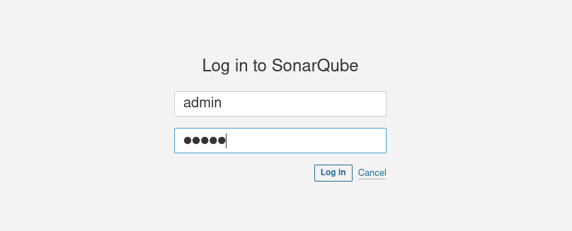
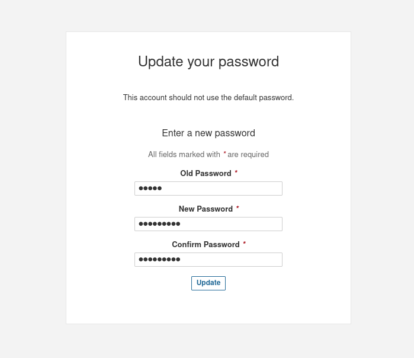

# SonarQube

## Install SonarQube On Ubuntu20.04

1. 安装 PostgreSQL

```shell
mkdir -pv /etc/apt/sources.list.d
sudo sh -c 'echo "deb https://mirrors.tuna.tsinghua.edu.cn/postgresql/repos/apt $(lsb_release -cs)-pgdg main" > /etc/apt/sources.list.d/pgdg.list'
wget -qO- https://mirrors.tuna.tsinghua.edu.cn/postgresql/repos/apt/ACCC4CF8.asc | sudo tee /etc/apt/trusted.gpg.d/pgdg.asc &>/dev/null

apt update
apt -y install postgresql postgresql-contrib
```

2. 创建数据库

```shell
passwd postgres

su - postgres

createuser sonar

createuser sonar

createuser sonar
psql 
ALTER USER sonar WITH ENCRYPTED password 'sonar';
CREATE DATABASE sonarqube OWNER sonar;
grant all privileges on DATABASE sonarqube to sonar;
\q
exit
```

3. 安装 Java 17

```shell
apt install fontconfig openjdk-17-jre
```

4. 调整内核参数

```shell
vim /etc/security/limits.conf
sonarqube   -   nofile   65536
sonarqube   -   nproc    4096

vim /etc/sysctl.conf
vm.max_map_count = 262144
```

5. 安装SonarQube

```shell
# 下载解压软件包
wget https://binaries.sonarsource.com/Distribution/sonarqube/sonarqube-9.9.0.65466.zip
unzip -d sonarqube-9.9.0.65466.zip -d /opt
mv /opt/sonarqube-9.9.0.65466 /opt/sonarqube
```
```shell
# 创建用户运行sonarqube
groupadd sonar
useradd -d /opt/sonarqube -g sonar sonar
chown sonar:sonar /opt/sonarqube -R
```
```shell
# 配置sonarqube
vim /opt/sonarqube/conf/sonar.properties
sonar.jdbc.username=sonar
sonar.jdbc.password=sonar
sonar.jdbc.url=jdbc:postgresql://localhost:5432/sonarqube
```
```shell
# 配置启动文件
vim /etc/systemd/system/sonar.service
[Unit]
Description=SonarQube service
After=syslog.target network.target

[Service]
Type=forking

ExecStart=/opt/sonarqube/bin/linux-x86-64/sonar.sh start
ExecStop=/opt/sonarqube/bin/linux-x86-64/sonar.sh stop

User=sonar
Group=sonar
Restart=always

LimitNOFILE=65536
LimitNPROC=4096

[Install]
WantedBy=multi-user.target
```
```shell
# 启动sonarqube
systemctl start sonar
tail -f /opt/sonarqube/logs/sonar.log
```
```shell
ss -tnlp|grep 9000
LISTEN   0        25                          *:9000                   *:*       users:(("java",pid=11069,fd=12))
```

6. 访问sonar UI

访问地址为：http://192.168.122.253:9000，默认用户名/密码为admin/admin。




